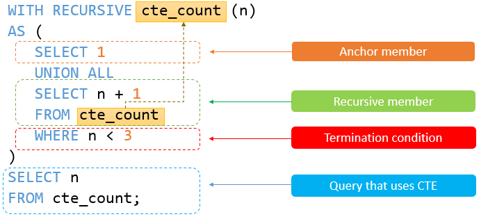

# LC-SQL

## 刪除數據 `delete`
```sql 
DELETE FROM table_name
WHERE condition;
```
* 練習題 : [196. Delete Duplicate Emails](./Leetcode-SQL/196.%20Delete%20Duplicate%20Emails.sql)、

* 基本架構 : [Delete方式](https://www.mysqltutorial.org/mysql-delete-statement.aspx)


## `Select`底下
* [不重複 `Distinct`](#Distinct()) 
* [`Max`、`min`、`avg`、`sum`](#maxminavgsum)
* [小數點`Round()`](#round)
* [絕對值`abs()`](#abs)
* [次方`power()`](#power)
* [開根號`sqrt()`](#sqrt)
* [`ifnull()`](#ifnull)
* [去除空格`trim()`](#trim)
* [換日期格式`date_format()`](#date_formatdate-format)
* [擷取資料片段`substring()`](#substringcolumn-第幾位-終點位)
* [資料合在同一個欄位`concat()`](#concat)
* [比較不同欄位最大最小值](#比較不同欄位：最小值least最大值greatest)
* [窗口函數Window Function](#窗口函數window-function)
  * [排名 `Rank()`](#rank)
  * [前筆數據`lag()` 後筆數據`lead()`](#lag和lead)
  * [算行數`row_num()`](#算行數row_number)
  * [`Over (Partition by Order by)`](#overpartition-by)

### `Distinct()`
* `Distinct()`練習題 : [596. Classes More Than 5 Students](./Leetcode-SQL/596.%20Classes%20More%20Than%205%20Students.sql)

### `Max`、`min`、`avg`、`sum`
正常情況要在`group by`的情況下才能用
* `min`練習題: [550. Game Play Analysis IV](./Leetcode-SQL/550.%20Game%20Play%20Analysis%20IV.sql)

### `Round()`
* `Round(欄位,小數點後幾位)`
* `Round()`練習題 : [597. Friend Requests_Acceptance Rate](./Leetcode-SQL/597.%20Friend%20Requests_Acceptance%20Rate.sql)

### `abs()`
* 絕對值:`abs(seat1,seat2)=1`用於兩個座位在隔壁
* `abs()`練習題 : [603. Consecutive Available Seats](./Leetcode-SQL/603.%20Consecutive%20Available%20Seats.sql)、[1459. Rectangles Area](./Leetcode-SQL/1459.%20Rectangles%20Area.sql)

### `power()`
* 次方：`power(某值,幾次方)`
* `power()`練習題 :[612. Shortest Distance in a Plane](./Leetcode-SQL/612.%20Shortest%20Distance%20in%20a%20Plane.sql)

### `sqrt()`
* 開根號：`sqrt(要開根號的值)`
* `sqrt()`練習題 :[612. Shortest Distance in a Plane](./Leetcode-SQL/612.%20Shortest%20Distance%20in%20a%20Plane.sql)

### `ifnull()`
* 是否為空值 : `ifnull(某欄,某欄為空的話要列出什麼值)`
* `ifnull()`練習題 : [1142. User Activity for the Past 30 Days II](./Leetcode-SQL/1142.%20User%20Activity%20for%20the%20Past%2030%20Days%20II.sql)、[1098. Unpopular Books](./Leetcode-SQL/1098.%20Unpopular%20Books.sql)、[1164. Product Price at a Given Date](./Leetcode-SQL/1164.%20Product%20Price%20at%20a%20Given%20Date.sql)

### `trim()`
* 去除空格
* 練習題: [1543. Fix Product Name Format](./Leetcode-SQL/1543.%20Fix%20Product%20Name%20Format.sql)
  
### `date_format(date, format)`
* 更改日期格式
* 練習題: [1543. Fix Product Name Format](./Leetcode-SQL/1543.%20Fix%20Product%20Name%20Format.sql)、[1565. Unique Orders and Customers Per Month](./Leetcode-SQL/1565.%20Unique%20Orders%20and%20Customers%20Per%20Month.sql)、[1193. Monthly Transactions I](./Leetcode-SQL/1193.%20Monthly%20Transactions%20I.sql)、[1479. Sales by Day of the Week](./Leetcode-SQL/1479.%20Sales%20by%20Day%20of%20the%20Week.sql)
* 基本架構 : [各種format的語法](https://www.w3schools.com/sql/func_mysql_date_format.asp)

### `substring(column, 第幾位, 終點位)`
* 擷取資料的某些部分(第幾位到第幾位)
* 練習題: [1565. Unique Orders and Customers Per Month](./Leetcode-SQL/1565.%20Unique%20Orders%20and%20Customers%20Per%20Month.sql)、[1667. Fix Names in a Table](./Leetcode-SQL/1667.%20Fix%20Names%20in%20a%20Table.sql)
### `concat()`
* 把兩個資料結合在同一欄位中
* 練習題:  [1667. Fix Names in a Table](./Leetcode-SQL/1667.%20Fix%20Names%20in%20a%20Table.sql)
### 比較不同欄位：最小值`least` 最大值`greatest`
* `least(x, y)`取x,y欄位之中最小值, `greatest(x, y)`取x,y欄位之中最大值
練習題

## 窗口函數Window Function
### `Over(Partition by Order by)` 
* 用於select裡面分類
* 前面可以是sum/count/max/min/rank...
```sql
sum/count/max/min/rank() over (<partition_definition> <order_definition>)
```

* `sum/count/max/min() over(partition by order by)`練習題 : [1303. Find the Team Size](./Leetcode-SQL/1303.%20Find%20the%20Team%20Size.sql)、[579. Find Cumulative Salary of an Employee](./Leetcode-SQL/579.%20Find%20Cumulative%20Salary%20of%20an%20Employee.sql)、[1097. Game Play Analysis V](./Leetcode-SQL/1097.%20Game%20Play%20Analysis%20V.sql)
* `sum/count() over()`適用於根據順序或時間的增加，累加某column：[1308. Running Total for Different Genders](./Leetcode-SQL/1308.%20Running%20Total%20for%20Different%20Genders.sql)、[1635. Hopper Company Queries I](./Leetcode-SQL/1635.%20Hopper%20Company%20Queries%20I.sql)
* 基本架構: [窗口函數中文講解](https://dbaplus.cn/news-11-2258-1.html)、[MySQL document](https://dev.mysql.com/doc/refman/8.0/en/window-functions-frames.html)

### `Over(Partition by Order by rang interval day preceding/following)`
用於運算一段時間內
```sql
sum/avg() over(order by <時間欄位> range interval '<向前數多少天數>' day preceding 
                                  and interval '<向後數多少天數>' day following)
```
* 練習題：[1321. Restaurant Growth](./Leetcode-SQL/1321.%20Restaurant%20Growth.sql)

### `Rank()`
* 要多一列排名要用`Rank() Over(Partition by 要分類的組 Order by 要排序的數值)`
```sql
rank() over (<partition_definition> <order_definition>)
```
* `Rank()`練習題 : [178. Rank Scores](./Leetcode-SQL/178.%20Rank%20Scores.sql)
### `dense_rank()`
*  排名不記算重複的名次 EX:11233 (`rank`的話11344)
*  重複的名次都會列出 `rank`和`max`就不會  
```sql
dense_rank() over (<partition_definition> <order_definition>)
```
*  `dense_rank()` 練習題 : [1076. Project Employees II](./Leetcode-SQL/1076.%20Project%20Employees%20II.sql)、[1077. Project Employees III](./Leetcode-SQL/1077.%20Project%20Employees%20III.sql)、[1082. Sales Analysis I](./Leetcode-SQL/1082.%20Sales%20Analysis%20I.sql)、[184. Department Highest Salary](./Leetcode-SQL/184.%20Department%20Highest%20Salary.sql)、[185. Department Top Three Salaries](./Leetcode-SQL/185.%20Department%20Top%20Three%20Salaries.sql)、[1112. Highest Grade For Each Student](./Leetcode-SQL/1112.%20Highest%20Grade%20For%20Each%20Student.sql)

### 算行數`Row_number()`
跟`rank()`很像，可以藉由order by排序。唯一不同是，`rank()`如果值一樣就會排名一樣，但`row_num()`不會，他都會有編號
```sql
ROW_NUMBER() OVER (<partition_definition> <order_definition>)
```
* 練習題 : [569. Median Employee Salary](./Leetcode-SQL/569.%20Median%20Employee%20Salary.sql)、[1159. Market Analysis II](./Leetcode-SQL/1159.%20Market%20Analysis%20II.sql)、[1164. Product Price at a Given Date](./Leetcode-SQL/1164.%20Product%20Price%20at%20a%20Given%20Date.sql)、[1174. Immediate Food Delivery II](./Leetcode-SQL/1174.%20Immediate%20Food%20Delivery%20II.sql)
* 基本架構 : [使用row_number](https://www.mysqltutorial.org/mysql-window-functions/mysql-row_number-function/)
### `lag()`和`lead()`
* 找當前數據的前一筆數據`lag() Over(Partition by 要分類的組 Order by 要排序的數值)`
* 找當前數據的後一筆數據`lead() Over(Partition by 要分類的組 Order by 要排序的數值)`
* 練習題 : [180. Consecutive Numbers](./Leetcode-SQL/180.%20Consecutive%20Numbers.sql)、[1097. Game Play Analysis V](./Leetcode-SQL/1097.%20Game%20Play%20Analysis%20V.sql)
* 基本架構 : [如何使用lag和lead](https://www.mysqltutorial.org/mysql-window-functions/mysql-lag-function/)

### `Preceding` and `Following`
* 指定當前行的前後行
```sql
#窗口範圍是當前行的兩筆加當前行，共三筆紀錄
ROWS BETWEEN 2 PRECEDING AND CURRENT ROW 

#窗口範圍是當前行、前一行、後一行一共三行記錄
ROWS BETWEEN 1 PRECEDING AND 1 FOLLOWING 

#窗口範圍是當前行到分區中的最後一行
ROWS UNBOUNDED FOLLOWING 

#窗口範圍是當前分區中所有行，等同於不寫
ROWS BETWEEN UNBOUNDED PRECEDING AND UNBOUNDED FOLLOWING 
```
* 練習題 : [579. Find Cumulative Salary of an Employee](./Leetcode-SQL/579.%20Find%20Cumulative%20Salary%20of%20an%20Employee.sql)、[1651. Hopper Company Queries III](./Leetcode-SQL/1651.%20Hopper%20Company%20Queries%20III.sql)
* 基本架構 : [需要搜preceding找關鍵字](https://dbaplus.cn/news-11-2258-1.html)


## `where`底下
* [`between`](#between)
* [`in`和`not in`](#in-and-not-in)
* [正規表達式`RegExp`](#regexpregular-expressions)
### `between`:
* 兩數之間: `beween 0 and 1000`
* 兩個日期之間: `between cast(20**-**-** as date) and cast(20**-**-** as date)` 或 `datediff('****-**-**',日期欄位名) < or = or > 相差天數` 或 `between '20**-**-**' and '20**-**-**'`

* `beween`練習題：[1084. Sales Analysis III](./Leetcode-SQL/1084.%20Sales%20Analysis%20III.sql)、[1141. User Activity for the Past 30 Days I](./Leetcode-SQL/1141.%20User%20Activity%20for%20the%20Past%2030%20Days%20I.sql)、[1142. User Activity for the Past 30 Days II](./Leetcode-SQL/1142.%20User%20Activity%20for%20the%20Past%2030%20Days%20II.sql)
### `datediff()`相差天數:
```sql
datediff(date1, date2) < or = or > 相差天數(date1-date2)
格式：'YYYY-MM-DD'
```
* `datediff`練習題：[1098. Unpopular Books](./Leetcode-SQL/1098.%20Unpopular%20Books.sql)、[1107. New Users Daily Count](./Leetcode-SQL/1107.%20New%20Users%20Daily%20Count.sql)
### `period_diff()`相差月份:
```sql
period_diff(period1, period2) < or = or > 相差月份(period1-period2)
格式：YYMM or YYYYMM
```
* `period_diff`練習題：[1843. Suspicious Bank Accounts](./Leetcode-SQL/1843.%20Suspicious%20Bank%20Accounts.sql)

### `in` and `not in`:
* 用於替除掉not in(要剃除的人) 
* 練習題 : [1083. Sales Analysis II](./Leetcode-SQL/1083.%20Sales%20Analysis%20II.sql)、[1350. Students With Invalid Departments](./Leetcode-SQL/1350.%20Students%20With%20Invalid%20Departments.sql)、[1581. Customer Who Visited but Did Not Make Any Transactions](./Leetcode-SQL/1581.%20Customer%20Who%20Visited%20but%20Did%20Not%20Make%20Any%20Transactions.sql)、[185. Department Top Three Salaries](./Leetcode-SQL/185.%20Department%20Top%20Three%20Salaries.sql)、[1112. Highest Grade For Each Student](./Leetcode-SQL/1112.%20Highest%20Grade%20For%20Each%20Student.sql)、[1398. Customers Who Bought Products A and B but Not C](./Leetcode-SQL/1398.%20Customers%20Who%20Bought%20Products%20A%20and%20B%20but%20Not%20C.sql)

### `regexp`(Regular Expressions):
* 正規表達式用於辨別大量字符、單詞等
* 可以來搜索電子郵件、IP、電話號碼等
```sql
SELECT 
    column_list
FROM
    table_name
WHERE
    string_column REGEXP pattern
```
* 練習題 :[1517. Find Users With Valid E-Mails](./Leetcode-SQL/1517.%20Find%20Users%20With%20Valid%20E-Mails.sql)、[1527. Patients With a Condition](./Leetcode-SQL/1527.%20Patients%20With%20a%20Condition.sql)
* 基本架構: [基於正規表達式Regexp的搜尋](https://www.yiibai.com/mysql/regular-expression-regexp.html)、[MySQL Documnent of Regular Expressions](https://dev.mysql.com/doc/refman/8.0/en/regexp.html)


## 以日期為條件
除了用between，如果是指定某月可以用 `month(date)=**`
* 練習題 : [1511. Customer Order Frequency](./Leetcode-SQL/1511.%20Customer%20Order%20Frequency.sql)


## 兩張表連結 `join`

* 普通`Join`(`inner join`): [603. Consecutive Available Seats](./Leetcode-SQL/603.%20Consecutive%20Available%20Seats.sql)
* `Left Join`: [577. Employee Bonus](./Leetcode-SQL/577.%20Employee%20Bonus.sql)、[1241. Number of Comments per Post](./Leetcode-SQL/1241.%20Number%20of%20Comments%20per%20Post.sql)、[1350. Students With Invalid Departments](./Leetcode-SQL/1350.%20Students%20With%20Invalid%20Departments.sql)、[608. Tree Node](./Leetcode-SQL/608.%20Tree%20Node.sql)、[1159. Market Analysis II](./Leetcode-SQL/1159.%20Market%20Analysis%20II.sql)、[1164. Product Price at a Given Date](./Leetcode-SQL/1164.%20Product%20Price%20at%20a%20Given%20Date.sql)

* `Cross Join`: [1280. Students and Examinations](./Leetcode-SQL/1280.%20Students%20and%20Examinations.sql)

* `join`同一張表: [1731. The Number of Employees Which Report to Each Employee](./Leetcode-SQL/1731.%20The%20Number%20of%20Employees%20Which%20Report%20to%20Each%20Employee.sql)
* `join`誤區 : [1148. Article Views I](./Leetcode-SQL/1148.%20Article%20Views%20I.sql)

* 基本架構 : [Join多種方式](https://www.mysqltutorial.org/mysql-join/)、[Having用途](https://www.mysqltutorial.org/mysql-having.aspx)


## 聯集`Union`

`Union`: 沒有重複值(only distinct values)
```sql
SELECT column_name(s) FROM table1
UNION
SELECT column_name(s) FROM table2;
```
`Union All`: 會有重複值(duplicate values)
```sql
SELECT column_name(s) FROM table1
UNION ALL
SELECT column_name(s) FROM table2;
```
練習題: [1435. Create a Session Bar Chart](./Leetcode-SQL/1435.%20Create%20a%20Session%20Bar%20Chart.sql)、[602. Friend Requests II Who Has the Most Friends](./Leetcode-SQL/602.%20Friend%20Requests%20II%20Who%20Has%20the%20Most%20Friends.sql)、[1127. User Purchase Platform](./Leetcode-SQL/1127.%20User%20Purchase%20Platform.sql)、[1194. Tournament Winners](./Leetcode-SQL/1194.%20Tournament%20Winners.sql)、[1369. Get the Second Most Recent Activity](./Leetcode-SQL/1369.%20Get%20the%20Second%20Most%20Recent%20Activity.sql)、[1555. Bank Account Summary](./Leetcode-SQL/1555.%20Bank%20Account%20Summary.sql)
  
基本架構 :[Union用法](https://www.w3schools.com/sql/sql_union.asp)


## `Group by` 和 `Having`和`Group_Concat()`
### `Having` 
只有在 `Group by`的情況下才用，用於分完組別後增加的條件
```sql
SELECT 
    select_list
FROM 
    table_name
WHERE 
    search_condition
GROUP BY 
    group_by_expression
HAVING 
    group_condition;
```
`having` 練習題: [596. Classes More Than 5 Students](./Leetcode-SQL/596.%20Classes%20More%20Than%205%20Students.sql)、[1327. List the Products Ordered in a Period](./Leetcode-SQL/1327.%20List%20the%20Products%20Ordered%20in%20a%20Period.sql)、[1511. Customer Order Frequency](./Leetcode-SQL/1511.%20Customer%20Order%20Frequency.sql)、[570. Managers with at Least 5 Direct Reports](./Leetcode-SQL/570.%20Managers%20with%20at%20Least%205%20Direct%20Reports.sql)、[1098. Unpopular Books](./Leetcode-SQL/1098.%20Unpopular%20Books.sql)、[1126. Active Businesses](./Leetcode-SQL/1126.%20Active%20Businesses.sql)

基本架構 : [Having用途](https://www.mysqltutorial.org/mysql-having.aspx)

### `Group_Concat`
  只有在group by條件下使用，用於把同一組的數據放進該組同一欄位內，`separator`用於數據間的分隔
```sql
GROUP_CONCAT(
    DISTINCT expression
    ORDER BY expression
    SEPARATOR sep
);
```
`group_concat` 練習題: [1484. Group Sold Products By The Date](./Leetcode-SQL/1484.%20Group%20Sold%20Products%20By%20The%20Date.sql)

基本架構 : [group_concat使用方法](https://www.mysqltutorial.org/mysql-group_concat/)

## 傳送指定行數的資料 `Limit` 和 `Offset`
LIMIT 接受一個或兩個數字參數。參數必須是一個整數常量。如果給定兩個參數，第一個參數指定第一個返回記錄行的偏移量，第二個參數指定返回記錄行的最大數目。
```sql 
-- limit是給幾個數據，offset是指定某行的下一行，如果要第一名就不用設offset
SELECT * FROM table LIMIT [offset,] rows | rows OFFSET offset

--這是兩個參數，第一個是偏移量，第二個是數目
select * from employee limit 3, 7; // 返回4-11行
select * from employee limit 3,1; // 返回第4行

--一個參數
select * from employee limit 3; // 返回前3行
```
練習題: [176. Second Highest Salary](./Leetcode-SQL/176.%20Second%20Highest%20Salary.sql)、[177. Nth Highest Salary](./Leetcode-SQL/177.%20Nth%20Highest%20Salary.sql)、[574. Winning Candidate](./Leetcode-SQL/574.%20Winning%20Candidate.sql)、[1204. Last Person to Fit in the Elevator](./Leetcode-SQL/1204.%20Last%20Person%20to%20Fit%20in%20the%20Elevator.sql)

基本框架: [limit offset中文使用方法](https://blog.csdn.net/AinUser/article/details/72803175)、[limit offset英文使用方法](https://www.guru99.com/limit.html)
  
## 假設條件情況`IF`
```sql
IF(expression ,expr_true, expr_false);
```
練習題：[626. Exchange Seats](./Leetcode-SQL/626.%20Exchange%20Seats.sql)、[1045. Customers Who Bought All Products
](./Leetcode-SQL/1045.%20Customers%20Who%20Bought%20All%20Products.sql)、[1097. Game Play Analysis V](./Leetcode-SQL/1097.%20Game%20Play%20Analysis%20V.sql)

基本框架：[if function](https://www.w3resource.com/mysql/control-flow-functions/if-function.php)
## 假設條件情況`Case`
Like an IF-THEN-ELSE statement. If there is no ELSE part and no conditions are true, it returns NULL.
```sql
CASE
    WHEN condition1 THEN result1
    WHEN condition2 THEN result2
    WHEN conditionN THEN resultN
    ELSE result
END;
```
練習題: [262. Trips and Users](./Leetcode-SQL/262.%20Trips%20and%20Users.sql)、[1179. Reformat Department Table](./Leetcode-SQL/1179.%20Reformat%20Department%20Table.sql)、[1211. Queries Quality and Percentage](./Leetcode-SQL/1211.%20Queries%20Quality%20and%20Percentage.sql)、[1294. Weather Type in Each Country](./Leetcode-SQL/1294.%20Weather%20Type%20in%20Each%20Country.sql)、[1322. Ads Performance](./Leetcode-SQL/1322.%20Ads%20Performance.sql)、[1661. Average Time of Process per Machine](./Leetcode-SQL/1661.%20Average%20Time%20of%20Process%20per%20Machine.sql)、、[1777. Product's Price for Each Store](./Leetcode-SQL/1777.%20Product's%20Price%20for%20Each%20Store)、[550. Game Play Analysis IV](./Leetcode-SQL/550.%20Game%20Play%20Analysis%20IV.sql)、[571. Find Median Given Frequency of Numbers](./Leetcode-SQL/571.%20Find%20Median%20Given%20Frequency%20of%20Numbers.sql)、[578. Get Highest Answer Rate Question](./Leetcode-SQL/578.%20Get%20Highest%20Answer%20Rate%20Question.sql)

## 虛擬表 `with virtual_table as()`
製作虛擬表，用於當表中沒有需要的欄位時
```sql
WITH Orders_CTE (Order_id, Number_of_Orders)
AS
(
SELECT Items_purchased, COUNT(Order_id) as Number_of_Orders
FROM orders
GROUP BY Items_purchased
)
SELECT AVG(Number_of_Orders) AS "Average Orders Per Category"
FROM Orders_CTE;
```
練習題: [1435. Create a Session Bar Chart](./Leetcode-SQL/1435.%20Create%20a%20Session%20Bar%20Chart.sql)、[1511. Customer Order Frequency](./Leetcode-SQL/1511.%20Customer%20Order%20Frequency.sql)、[1581. Customer Who Visited but Did Not Make Any Transactions](./Leetcode-SQL/1581.%20Customer%20Who%20Visited%20but%20Did%20Not%20Make%20Any%20Transactions.sql)、[571. Find Median Given Frequency of Numbers](./Leetcode-SQL/571.%20Find%20Median%20Given%20Frequency%20of%20Numbers.sql)、[578. Get Highest Answer Rate Question](./Leetcode-SQL/578.%20Get%20Highest%20Answer%20Rate%20Question.sql)、[615. Average Salary: Departments VS Company](./Leetcode-SQL/615.%20Average%20Salary:%20Departments%20VS%20Company.sql)、[1097. Game Play Analysis V](./Leetcode-SQL/1097.%20Game%20Play%20Analysis%20V.sql)、[1132. Reported Posts II](./Leetcode-SQL/1132.%20Reported%20Posts%20II.sql)

基本架構 : [with用法](https://www.educba.com/sql-with-clause/)

## 遞歸 `with recursive vitrual_table as()`

```sql
WITH RECURSIVE cte_name AS (
    initial_query  -- anchor member
    UNION ALL
    recursive_query -- recursive member that references to the CTE name
)
SELECT * FROM cte_name;
```
### **A recursive CTE consists of three main parts:**

1. An initial query that forms the base result set of the CTE structure. The initial query part is referred to as an anchor member.
2. A recursive query part is a query that references to the CTE name, therefore, it is called a recursive member. The recursive member is joined with the anchor member by aUNION ALL or UNION DISTINCT operator.
3. A termination condition that ensures the recursion stops when the recursive member returns no row.

### **The execution order of a recursive CTE is as follows:**

1. First, separate the members into two: anchor and recursive members.
2. Next, execute the anchor member to form the base result set ( R0) and use this base result set for the next iteration.
3. Then, execute the recursive member with Ri result set as an input and make Ri+1 as an output.
4. After that, repeat the third step until the recursive member returns an empty result set, in other words, the termination condition is met.
5. Finally, combine result sets from R0 to Rn using UNION ALL operator.

```sql
WITH RECURSIVE cte_count (n) 
AS (
      SELECT 1 -- 第一個select的1是anchor number代表開始值
      UNION ALL
      SELECT n + 1 -- 第二個select為recursive number，代表一次跳多少格
      FROM cte_count 
      WHERE n < 3 -- where 是設定n的限制
    )
SELECT n 
FROM cte_count;
```


練習題：[1270. All People Report to the Given Manager](./Leetcode-SQL/1270.%20All%20People%20Report%20to%20the%20Given%20Manager.sql)、[1336. Number of Transactions per Visit](./Leetcode-SQL/1336.%20Number%20of%20Transactions%20per%20Visit.sql)、[1384. Total Sales Amount by Year](./Leetcode-SQL/1384.%20Total%20Sales%20Amount%20by%20Year.sql)、[1613. Find the Missing IDs](./Leetcode-SQL/1613.%20Find%20the%20Missing%20IDs.sql)、[1635. Hopper Company Queries I](./Leetcode-SQL/1635.%20Hopper%20Company%20Queries%20I.sql)

基本架構：[recursive CTE的用法](https://www.mysqltutorial.org/mysql-recursive-cte/)


## 精選需要動一陣子腦袋的題目：
1. 分組後經由時間排序選擇第幾個，這兩個邏輯很相似(套很多虛擬表，一定要left join)：[1159. Market Analysis II](./Leetcode-SQL/1159.%20Market%20Analysis%20II.sql)、[1164. Product Price at a Given Date](./Leetcode-SQL/1164.%20Product%20Price%20at%20a%20Given%20Date.sql)

2. 排名找最高，這題想超久(join on的條件很多，還有用到union all)：[1127. User Purchase Platform](./Leetcode-SQL/1127.%20User%20Purchase%20Platform.sql)

3. 這題剛開始覺得難，想到可以下手的點，做出來的時間就會蠻快的(要先union all再層層虛擬表查詢，所以很多虛擬表)：[1194. Tournament Winners](./Leetcode-SQL/1194.%20Tournament%20Winners.sql)

4. 數值經排序後，累積加總，這題不那麼直覺想到解法(善用sum over(order by) 和 limit)：[1204. Last Person to Fit in the Elevator](./Leetcode-SQL/1204.%20Last%20Person%20to%20Fit%20in%20the%20Elevator.sql)
相似題(也是算累積加總，請善用count() over(order by time))：[1635. Hopper Company Queries I](./Leetcode-SQL/1635.%20Hopper%20Company%20Queries%20I.sql)、1635的進階題[1645. Hopper Company Queries II](./Leetcode-SQL/1645.%20Hopper%20Company%20Queries%20II.sql)

5. 求連續期間中最大和最小，這題是看解答，因為想不到方法，而解答給的方法思維也很跳(善用rank over(有和沒有partition by)的差異)：[1225. Report Contiguous Dates](./Leetcode-SQL/1225.%20Report%20Contiguous%20Dates.sql)、[1285. Find the Start and End Number of Continuous Ranges](./Leetcode-SQL/1285.%20Find%20the%20Start%20and%20End%20Number%20of%20Continuous%20Ranges.sql)
相似題：[1454. Active Users](./Leetcode-SQL/1454.%20Active%20Users.sql)、[1811. Find Interview Candidates](./Leetcode-SQL/1811.%20Find%20Interview%20Candidates.sql)

6. 這題沒用過的用法，用於計算特定天數(善用preceding and following)：[1321. Restaurant Growth](./Leetcode-SQL/1321.%20Restaurant%20Growth.sql)

7. 排除第一和最後一名(善用rank over(order by 有沒有desc)的差異)：[1412. Find the Quiet Students in All Exams](./Leetcode-SQL/1412.%20Find%20the%20Quiet%20Students%20in%20All%20Exams.sql)

8. 給x, y數值和><=等運算符，query判斷式子是否正確：[1440. Evaluate Boolean Expression](./Leetcode-SQL/1440.%20Evaluate%20Boolean%20Expression.sql)

9. 加總前後數據(善用`sum() over(rows between 1 preceding and current row and 1 following)`)：[579. Find Cumulative Salary of an Employee](./Leetcode-SQL/579.%20Find%20Cumulative%20Salary%20of%20an%20Employee.sql)、[1651. Hopper Company Queries III](./Leetcode-SQL/1651.%20Hopper%20Company%20Queries%20III.sql)

## Reference
[MySQL Tutorial](https://www.mysqltutorial.org/mysql-delete-statement.aspx)